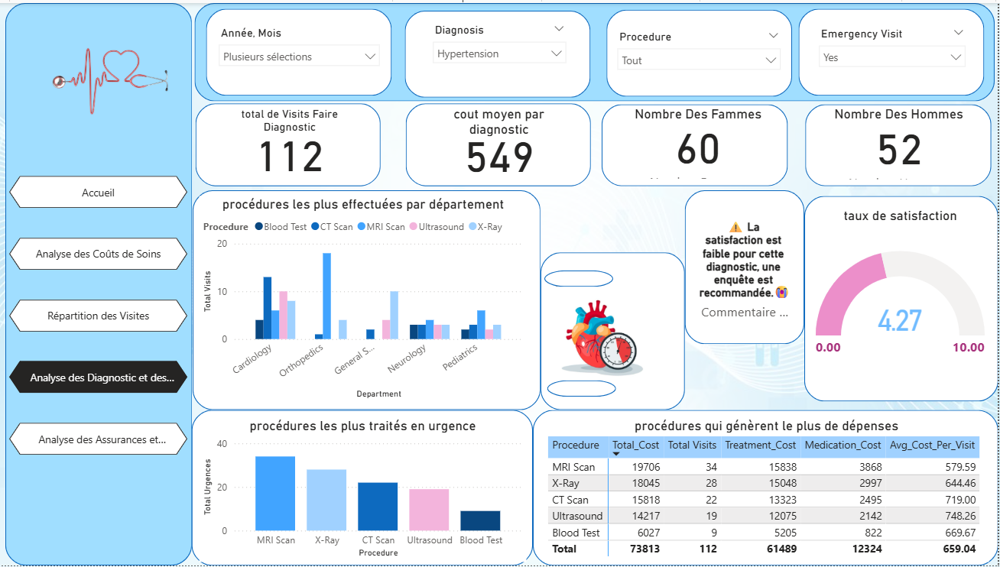

# 🏥 HealthCare Power BI Dashboard

## 📊 Project Overview
This Power BI project, **HealthCare Dashboard**, aims to analyze and visualize medical data within a hospital environment.  
It provides insights into **diagnoses, procedures, treatment costs, and patient statistics** to support better medical and administrative decision-making.

---

## 🎯 Objectives
- Identify the **most costly diagnoses and medical procedures**  
- Analyze **hospital performance and resource allocation**  
- Visualize **emergency cases and procedure trends**  
- Support **data-driven healthcare management** decisions

---

## 🧩 Key Features
- Dynamic filters by **year, diagnosis, and procedure**
- Visualization of **medical costs and emergency rates**
- Interactive dashboards with clear and modern visuals
- Data-driven insights for **hospital management optimization**

---

## 🧠 Technologies Used
- **Power BI Desktop** for dashboard creation  
- **Excel / CSV files** as data sources  
- **DAX** and **Power Query** for data transformation and metrics

---

## 🖼️ Preview

> *(Add your screenshot inside an `/images` folder with the same name.)*

---

## 📁 Project Structure
